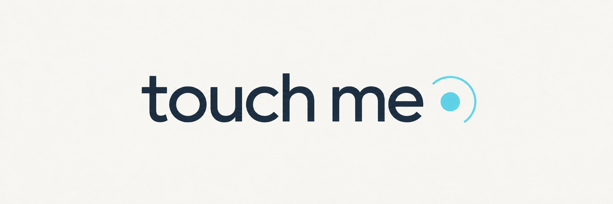
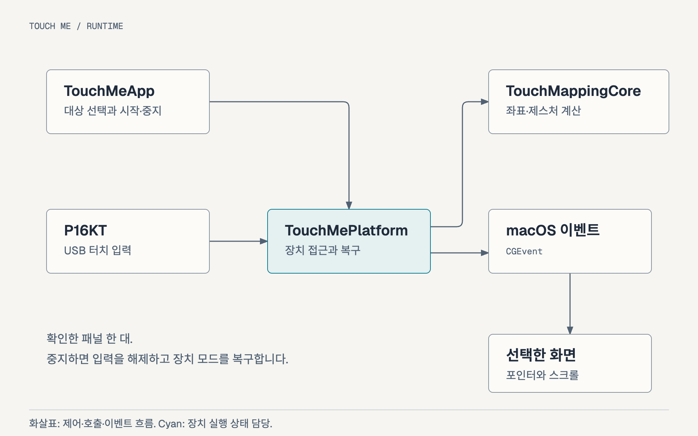

[English](README.md) · [한국어](README.ko.md) · [개발 Workflow](Workflow.ko.md) · [Homebrew 배포](docs/Homebrew.ko.md)

<!-- meta.contentType: Landing; audience: ZEUSLAP owners with the verified P16KT profile; goal: install and operate Touch Me; content plan: purpose, current scope, installation, gestures, recovery, documentation, validation, license. -->

# 맥에서도 ZEUSLAP 터치 모니터 쓰기

Touch Me는 ZEUSLAP 터치 모니터를 Mac에서 활용할 수 있도록 만든 macOS 메뉴 막대 앱입니다. MacBook을 비롯한 Mac에서 터치 입력이 제대로 작동하지 않는 문제를 해결하고, 화면을 손가락으로 직접 조작할 수 있도록 돕는 것이 목적입니다.

터치 입력을 선택한 화면의 좌표에 맞춰 전달해 탭과 더블 클릭, 한 손가락 드래그, 두 손가락 스크롤을 사용할 수 있습니다. 앱에서 대상 화면을 선택하고 확인한 뒤 매핑을 시작하며, 메뉴 막대에서 매핑을 중지하거나 설정을 바꿀 수 있습니다.

Beta `0.8.0-beta.5`는 **P16KT에서 확인한 USB/HID profile**을 요구합니다. 장치 식별자와 HID(Human Interface Device) 입력 구조가 다르면 매핑을 시작하지 않습니다. 다른 ZEUSLAP 모델까지 지원한다고 보장하지 않으므로 아래 환경을 먼저 확인해 주세요.

[Beta.5 build 23](https://github.com/soom-kang/touch-me/releases/tag/v0.8.0-beta.5)을 공개했고 public DMG·checksum 확인은 통과했습니다. 공개 beta.4 → beta.5 Homebrew 업그레이드 단계가 완료됐으며 설치 산출물도 build 23과 일치했습니다. 업그레이드 후 GUI·권한·제스처 확인은 대기 중이므로 QA01은 `PENDING`입니다. [Acceptance 기록](docs/qa/beta5-native-acceptance.md)을 확인하세요.

## 먼저 사용 환경을 확인하세요

Apple Silicon Mac에서 P16KT 한 대를 연결하는 환경을 대상으로 합니다. 실기기에서 확인한 조합은 Apple M4 Max, macOS 26.7.1과 USB-C 직접 연결입니다:

| 항목 | 현재 범위 |
| --- | --- |
| Mac | Apple Silicon(arm64), macOS 26 이상 |
| 터치 패널 | ZEUSLAP P16KT 한 대; USB 장치 `0x0457:0x0819` |
| 대상 화면 | 회전과 미러링을 사용하지 않는 외부 화면 |
| 권한 | 입력 모니터링과 손쉬운 사용 |
| 앱 언어 | 기본값 영어; 설정에서 English / 한국어 선택 |
| 배포 | Ad hoc 서명 앱과 DMG; 개인 Homebrew beta Tap |

다른 패널, Intel Mac과 이전 macOS 버전은 검증 기록이 없습니다. Touch Me를 열기 전에 다른 터치 매핑 프로그램을 중지하세요.

## 설치하고 첫 매핑 시작하기

Homebrew로 설치하거나 공개한 beta.5 DMG에서 앱을 복사할 수 있습니다. 어느 쪽으로 설치하든 다음 권한과 대상 화면 설정은 같습니다.

### Homebrew로 설치하기

수동 설치한 `/Applications/Touch Me.app`이 이미 있다면 **로그인 시 Touch Me 열기**를 끄고 **매핑 중지**를 선택하세요. 장치 모드 복구가 끝난 것을 확인한 뒤 정상 종료하고 기존 앱을 Applications 밖으로 옮겨 보존하세요. 복구에 실패하면 설치를 멈추세요. 강제 덮어쓰기 없이 기존 앱과 환경설정을 보존하는 방법은 [Homebrew 설치 안내](docs/Homebrew.ko.md#공개-후-설치업데이트제거)에 정리했습니다.

기존 Tap의 Cask로 설치하세요:

```bash
brew install --cask soom-kang/touch-me/touch-me
```

### DMG로 설치하기

[Beta.5 release](https://github.com/soom-kang/touch-me/releases/tag/v0.8.0-beta.5)에서 `touch-me-0.8.0-beta.5-arm64.dmg`와 `.sha256` 파일을 받으세요. 버전·build `0.8.0-beta.5`/23과 [release notes](docs/releases/v0.8.0-beta.5.md)의 checksum을 확인한 뒤 디스크 이미지를 열어 **Touch Me.app**을 **Applications**로 끌어 복사하세요. 복사를 마치면 이미지를 추출하세요.

Beta는 ad hoc 서명을 사용하며 공증하지 않았습니다. macOS가 다운로드한 앱의 첫 실행을 차단하면 출처와 checksum을 확인한 뒤 [Apple의 수동 실행 승인 안내](https://support.apple.com/en-us/102445)를 따르세요. 승인 항목이 보이더라도 앱 실행을 보장하지는 않습니다.

### 권한과 대상 화면 맞추기

설치한 앱을 열고 메뉴 막대의 **Settings / Proof**(**설정 / 시험**)를 여세요. 저장한 언어 선택이 없으면 영어로 시작합니다. 상단의 **Language / 언어**에서 **English** 또는 **한국어**를 선택하세요.

선택한 언어는 바로 적용되고 다음 실행에도 유지됩니다. 언어를 바꿔도 실행 중인 매핑, 선택한 대상과 시험 기록은 그대로이며 macOS 대화상자는 자체 언어를 따릅니다.

다음 순서로 권한과 대상 화면을 설정하세요:

1. **시스템 설정 → 개인정보 보호 및 보안**에서 **입력 모니터링**과 **손쉬운 사용**에 Touch Me를 허용하세요.
2. P16KT를 USB-C로 연결하세요. 권한이나 장치가 보이지 않으면 **다시 조회**를 누르세요.
3. P16KT 화면을 선택하고 **선택 화면에서 시험 창 열기**를 누르세요.
4. 시험 창이 P16KT에 나타나는지 확인한 뒤 **시험 창이 P16KT에 표시되는 것을 확인했습니다**를 선택하세요.
5. **매핑 시작**을 누르고 서로 떨어진 두 위치에서 탭 좌표를 확인하세요.

설정 창을 닫아도 앱은 메뉴 막대에 남고 매핑은 계속됩니다.

## 손가락으로 사용하기

한 손가락으로 클릭하거나 끌고 두 손가락으로 스크롤하세요:

| 동작 | 제스처 |
| --- | --- |
| 클릭 또는 더블 클릭 | 한 번 또는 두 번 탭하며, 각 클릭은 손가락을 뗄 때 발생 |
| 드래그 | 한 손가락을 처음 위치에서 화면 좌표 8단위보다 멀리 이동 |
| 세로 또는 가로 스크롤 | 드래그가 시작되기 전에 두 손가락을 대고 함께 이동하며, 클릭은 발생하지 않음 |
| 드래그 중 두 번째 손가락 추가 | 드래그는 처음 손가락을 계속 따라감 |
| 드래그와 스크롤 전환 | 손가락을 모두 뗀 뒤 새 제스처 시작 |

스크롤 후 화면에 남은 손가락으로는 클릭이나 드래그를 시작할 수 없습니다. 손가락을 모두 뗀 뒤 다시 시작하세요.

## 중지하고 다시 시작하기

메뉴의 **매핑 중지**를 선택하면 입력을 해제하고 다음 실행에서도 중지 상태를 유지합니다. 매핑 중 정상 종료하면 다시 시작할 의도를 저장합니다. 자동 재개하려면 저장한 화면과 USB 위치가 일치하고 두 권한이 모두 허용돼야 합니다.

앱은 화면 잠금, 절전이나 사용자 세션 비활성화로 매핑을 잠시 중지해도 재개할 의도를 보존합니다. 돌아오면 저장한 패널·USB 위치·화면과 권한을 다시 확인한 뒤 매핑을 시작합니다. 준비 확인은 10초의 재시도 구간 안에서 진행하며, 이미 실행 중인 장치 호출은 더 오래 걸릴 수 있습니다. 복구 구간이 만료되면 직접 시작해야 합니다. 실제 중단을 확인한 경우에는 첫 재개 후에도 같은 복구 구간을 유지합니다. 그 안에서 일시적인 대상 변경이 발생하면 원래 화면 구성과 저장한 장치가 다시 일치할 때만 재시도하며, 재시도로 복구 시간을 연장하지 않습니다. **매핑 중지**, 다른 매핑 오류와 복구 구간 밖의 별도 대상 변경은 자동 재개를 취소합니다. 장치 모드 복구 오류가 있으면 먼저 **복구 재시도**를 수행해야 합니다.

**로그인 시 Touch Me 열기**는 기본값이 꺼짐입니다. 앱을 Applications에 설치한 뒤 설정에서 켤 수 있습니다. 이 옵션은 로그인할 때 앱을 여는 설정이고 매핑 재개 여부는 저장한 실행 상태에 따릅니다.

## 오류 복구와 업데이트, 제거

매핑 중에는 확인한 P16KT의 장치 모드를 임시로 변경합니다. 중지하거나 정상 종료하면 입력을 해제하고 변경했던 모드를 원래 값으로 복구합니다. 복구에 실패하면 앱 종료가 차단될 수 있습니다:

| 상황 | 다음 행동 |
| --- | --- |
| 권한이 부족함 | 두 개인정보 보호 설정에서 Touch Me를 허용하고 **다시 조회**를 누르세요 |
| 패널이나 화면이 바뀜 | 저장한 패널과 대상 화면을 다시 확인하세요. 미복구 기록은 같은 연속 연결을 요구합니다 |
| 장치 접근에 실패함 | 다른 매핑 프로그램을 중지하고 USB 연결을 확인하세요 |
| 장치 모드 복구에 실패함 | 현재 연결을 유지하고 **복구 재시도**를 누르세요. 연결이 바뀌면 복구를 차단합니다 |

강제 종료, 충돌이나 전원 손실에서는 정상 정리 절차를 실행할 수 없습니다. 공개 beta.4와 이전 beta.5 build 22는 원래 모드를 프로세스 메모리에만 저장합니다. Build 22는 한 번의 `SIGKILL`과 재실행 → Stop → 정상 Quit 뒤에도 모드 2가 남았고 별도 진단으로 저장한 `(0,0)`을 복구했습니다. 새 후보는 모드 변경 전에 원래 값을 기록하며 이전 소유자의 종료와 같은 부팅·계속 연결된 장치 식별이 확인될 때만 복구합니다. 연결이 바뀌거나 기록이 불확실하면 매핑을 차단하며 같은 포트에 다시 연결해도 복구를 허용하지 않습니다. Build 23은 원래 모드 0·같은 부팅·계속 연결된 P16KT 조건의 SIGKILL·재실행 복구 한 번을 통과했으며 다른 중단 조건은 아직 검증하지 않았습니다.

앱 재실행이나 이후 중지 성공만으로 충돌 전 모드가 복구됐다고 판단하지 마세요. 장치 동작이 예상과 다르면 매핑을 중지하고 업데이트와 제거를 보류하며 오류 내용을 보존하세요. 추측한 모드 값을 장치에 강제로 쓰지 마세요. 자세한 확인 범위는 [비정상 종료 검증](docs/qa/abnormal-exit-recovery.md)에 정리했습니다.

업데이트하거나 제거하기 전에는 **매핑 중지 → 장치 모드 복구 확인 → 정상 종료**를 수행하세요. 복구에 실패하면 현재 연결을 유지하고 복구 재시도를 마칠 때까지 진행하지 마세요. 연결이 바뀌면 복구를 차단하므로 기록과 오류를 보존하세요. Ad hoc 앱을 업데이트한 뒤에는 두 개인정보 보호 권한을 다시 확인하세요.

제거할 때는 **로그인 시 Touch Me 열기**도 꺼 주세요. 직접 설치한 앱은 복구와 종료를 마친 뒤 휴지통으로 옮기고 Homebrew로 설치한 앱은 [업데이트와 제거 안내](docs/Homebrew.ko.md#공개-후-설치업데이트제거)를 따르세요. 이 절차는 저장한 환경설정을 삭제하지 않습니다.

## 구조와 자세한 문서

앱에서 대상을 선택하고 매핑을 시작하면 Platform 코드가 패널 입력을 읽습니다. Core의 좌표와 제스처 로직으로 처리한 뒤 마우스와 스크롤 이벤트를 선택한 화면에 맞춰 macOS로 전달합니다.



직접 빌드하거나 배포 과정을 확인하려면 아래 문서를 참고하세요:

- [개발 Workflow](Workflow.ko.md): 모듈별 역할, 로컬 빌드와 패키징, 변경에 맞는 검증
- [Homebrew 배포](docs/Homebrew.ko.md): Tap과 release 절차, 설치 충돌, 업데이트와 제거
- [beta.4 release notes](docs/releases/v0.8.0-beta.4.md): 이번 버전의 변경과 검증 한계
- [beta.5 release notes](docs/releases/v0.8.0-beta.5.md): 변경, 검증 범위와 공개 업그레이드 상태
- [편집 가능한 구조 다이어그램](docs/assets/architecture.ko.html)

로컬 후보 DMG 경로는 `dist/touch-me-0.8.0-beta.5-arm64.dmg`이며 공개 다운로드 경로가 아닙니다.

## 기록된 검증 결과

2026-10-07(`Asia/Seoul`)의 build 8 단독 검증에서 보존한 결과입니다. 아래 입력 동작은 사용자 보고이며 프로세스와 산출물은 별도로 확인했습니다:

- 탭 좌표, 한 손가락 드래그와 정상 종료 후 입력 해제
- 사전 탭 없는 두 손가락 세로 스크롤과 가로 스크롤
- 더블 클릭 감지와 정상 종료 후 자동 재개
- 중지 상태 유지, 로그인 항목 등록과 해제
- 개인용 DMG의 Finder 설치와 설치 후 매핑

이는 과거 기록이며 beta.3나 재생성한 앱을 새로 실기기에서 검증한 결과가 아닙니다. 실제 로그아웃과 로그인 실행은 `NOT_RUN`, 자동 재개 후 가로 스크롤은 `NOT_RETESTED`입니다. 다른 매핑 프로그램이 개입했을 수 있는 초기 시험은 단독 동작의 근거로 사용하지 않습니다.

2026-10-08에 사용자는 build 18의 잠금·해제 후 로그인하자마자 터치가 정상 작동했다고 확인했습니다. 해당 build에는 beta.3에 포함되는 복구 코드가 들어 있습니다. 한 번의 사용자 확인 결과이며 정확한 복구 시간을 보장하지 않습니다.

beta.3 release 앱을 설치하거나 실기기에서 실행하지는 않았습니다. 해당 release의 Homebrew 설치, Gatekeeper, 절전·복귀와 실제 로그아웃·로그인 검사는 `NOT_RUN`이었습니다.

2026-10-09 제스처 수정 후 기존 Swift 테스트 14개가 모두 통과했습니다. 사용자는 build 20에서 엇갈린 두 손가락 스크롤 중 누름 횟수가 늘지 않고 탭·더블 클릭·드래그와 최초 손가락 추적이 정상이라고 보고했습니다(`PASS_USER_REPORTED`). 실제 이벤트를 직접 관찰한 결과는 아닙니다. beta.4 배포 준비 당시 build 21은 설치하거나 패널에서 실행하지 않았으며, 해당 산출물의 native/device·Homebrew 설치·Gatekeeper 검사는 `NOT_RUN`이었습니다. [개발 Workflow의 검증 기록](Workflow.ko.md#변경에-맞는-최소-검증-선택하기)과 [beta.4 release notes](docs/releases/v0.8.0-beta.4.md)를 확인하세요.

## 라이선스

Touch Me에는 [MIT License](LICENSE)를 적용합니다. 저작권 표기는 2026 Soom Kang입니다. 앱 메뉴의 **라이선스**에서도 읽을 수 있습니다.
