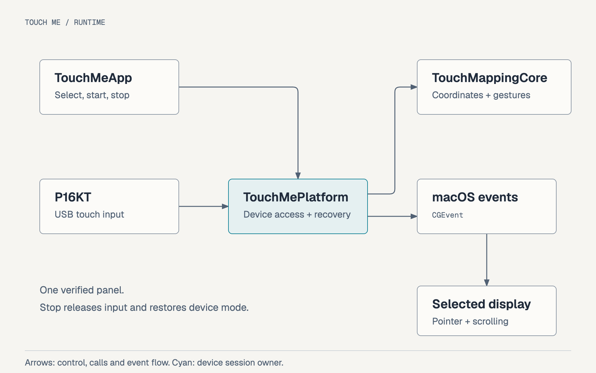

[English](README.md) · [한국어](README.ko.md) · [Build workflow](Workflow.md) · [Homebrew distribution](docs/Homebrew.md)

<!-- meta.contentType: Landing; audience: ZEUSLAP owners with the verified P16KT profile; goal: install and operate Touch Me; content plan: purpose, current scope, installation, gestures, recovery, documentation, validation, license. -->

# Use your ZEUSLAP touchscreen on macOS

Touch Me is a macOS menu bar app built to help you use ZEUSLAP touch-enabled monitors on a Mac. Its purpose is to address touch input that does not work properly on MacBooks and other Macs, helping you interact directly with the screen using your fingers.

It maps touch input to the display you select, enabling taps, double-clicks, one-finger dragging and two-finger scrolling. Choose and confirm the target display in the app, then start mapping. Use the menu bar to stop mapping or change settings.

The current beta, `0.8.0-beta.4`, requires the **USB/HID profile verified on the P16KT**. Mapping won't start if the device identifiers or HID (Human Interface Device) input layout differ. Support for other ZEUSLAP models isn't guaranteed, so check the setup below first.

## Check your setup first

The app targets one connected P16KT on an Apple Silicon Mac. Recorded hardware checks used an Apple M4 Max, macOS 26.7.1 and a direct USB-C connection:

| Item | Current scope |
| --- | --- |
| Mac | Apple Silicon (arm64), macOS 26 or later |
| Touch panel | One ZEUSLAP P16KT; USB device `0x0457:0x0819` |
| Target display | External, without rotation or mirroring |
| Permissions | Input Monitoring and Accessibility |
| App languages | English by default; English / 한국어 selector in settings |
| Distribution | Ad hoc signed app and DMG; personal Homebrew beta Tap |

Other panels, Intel Macs and older macOS versions have no recorded validation. Stop other touch-mapping software before opening Touch Me.

## Install and start your first mapping session

Install through Homebrew or copy the app from its DMG. Both routes use the same permission and target-display setup below.

### Install with Homebrew

If you already have a manually installed `/Applications/Touch Me.app`, turn off **Open Touch Me at login** and select **Stop mapping**. Confirm device-mode restoration completed, then quit normally and move the old app outside Applications to keep it. Stop installation if restoration fails. The [Homebrew installation guide](docs/Homebrew.md#install-update-and-remove-after-publication) explains how to preserve the app and preferences without forcing an overwrite.

Install the Cask from the existing Tap:

```bash
brew install --cask soom-kang/touch-me/touch-me
```

### Install from the DMG

Download the arm64 DMG and its `.sha256` file from the [v0.8.0-beta.4 release](https://github.com/soom-kang/touch-me/releases/tag/v0.8.0-beta.4). Verify the source and checksum, then open the disk image and drag **Touch Me.app** to **Applications**. Eject the image after copying.

The beta has an ad hoc signature and isn't notarized. If macOS blocks the downloaded app's first launch, verify its source and checksum before following [Apple's manual approval guidance](https://support.apple.com/en-us/102445). An available approval option doesn't guarantee the app can run.

### Set permissions and choose the target display

Open the installed app and choose **Settings / Proof** from the menu bar. Without a saved language choice, the app starts in English. Use **Language / 언어** at the top to choose **English** or **한국어**.

The choice takes effect immediately and stays selected on the next launch. Switching languages preserves the running mapping session, selected target and test history. macOS dialogs keep their own language.

Set permissions and the target display in this order:

1. In **System Settings → Privacy & Security**, allow Touch Me in **Input Monitoring** and **Accessibility**.
2. Connect the P16KT by USB-C. Select **Refresh** if permissions or the device aren't visible.
3. Select the P16KT display and choose **Open test on selected display**.
4. Check that the test window appears on the P16KT, then select **I confirmed the test window is on the P16KT**.
5. Select **Start mapping** and check taps at two separated positions.

Closing settings leaves the app in the menu bar and mapping active.

## Use your fingers

Use one finger to click or drag and two fingers to scroll:

| Action | Gesture |
| --- | --- |
| Click or double-click | Tap once or twice; each click happens when you lift the finger |
| Drag | Move one finger more than 8 screen-coordinate units from its starting position |
| Scroll vertically or horizontally | Place two fingers before dragging starts, then move them together; no click is sent |
| Add a second finger during a drag | The drag continues to follow the first finger |
| Switch between dragging and scrolling | Lift all fingers, then start the new gesture |

After scrolling, a finger left on the screen cannot start a click or drag. Lift all fingers before starting again.

## Stop and start again

Select **Stop mapping** from the menu to release input and keep mapping stopped on the next launch. Quitting normally while mapping saves the intent to resume. Automatic resume requires the saved display and USB location to match and both permissions to be granted.

The app pauses mapping for screen lock, sleep or an inactive user session while preserving the intent to resume. After returning, it checks the saved panel, USB location, display and permissions before restarting. Readiness retries have a ten-second window; native device calls already in progress can take longer. If recovery expires, start manually. For a confirmed interruption, that same recovery window stays open after the first restart: a temporary target change can retry only when the original display configuration and saved device match again. Retries do not extend the window. Explicit **Stop mapping**, other mapping errors and independent target changes outside that window cancel automatic resume. A device-mode restoration error requires **Retry restore** first.

**Open Touch Me at login** is off by default. Enable it in settings after installing the app in Applications. This option opens the app at login; the saved mapping state determines whether mapping resumes.

## Recover, update or remove the app

Mapping temporarily changes the verified P16KT device mode. Stop or normal Quit releases input and restores the original mode when a change was necessary. A restoration error can prevent the app from quitting:

| Situation | Next action |
| --- | --- |
| A permission is missing | Allow Touch Me in both privacy settings, then select **Refresh** |
| The panel or display changed | Reconnect the saved panel to the same USB port; select and confirm the display again |
| Device access fails | Stop other mappers and check the USB connection |
| Device-mode restoration fails | Reconnect the P16KT to the same USB port and select **Retry restore** in settings |

Force Quit, a crash or power loss can't run normal cleanup. The app stores the original device mode only in the current process's memory; it doesn't recover the previous process's mode after a crash. Whether the panel retains the changed mode after that interruption hasn't been validated.

Don't treat reopening the app or a later successful Stop as proof that the pre-crash mode was restored. If device behavior is unexpected, stop mapping, put upgrades and removal on hold, and keep the error details. Don't force an assumed mode value onto the device. See the [abnormal-exit verification notes](docs/qa/abnormal-exit-recovery.md) for the verification scope.

Before updating or removing the app, follow **Stop mapping → confirm device-mode restoration → normal Quit**. If restoration fails, reconnect the panel to the same USB port and finish recovery before proceeding. After an ad hoc update, check both privacy permissions again.

Turn off **Open Touch Me at login** before removal. After restoration and Quit, move a manually installed app to Trash. For a Homebrew installation, follow the [update and removal guide](docs/Homebrew.md#install-update-and-remove-after-publication). These steps preserve saved preferences.

## Architecture and further reading

After you choose a target and start mapping, platform code reads input from the panel. It runs Core coordinate and gesture logic, then posts mouse and scroll events to macOS for that display.



For local builds or distribution details, read these documents:

- [Build workflow](Workflow.md): module responsibilities, local builds, packaging and checks for each change
- [Homebrew distribution](docs/Homebrew.md): Tap and release procedure, installation conflicts, updates and removal
- [Beta.4 release notes](docs/releases/v0.8.0-beta.4.md): changes and validation limits for this version
- [Editable architecture diagram](docs/assets/architecture.html)

A local build produces `dist/touch-me-0.8.0-beta.4-arm64.dmg`.

## Recorded validation

These results preserve standalone build 8 checks from 2026-10-07, in `Asia/Seoul`. The input behavior below came from user reports; process and artifact checks were separate:

- Tap coordinates, one-finger drag and input release after normal Quit
- Two-finger vertical and horizontal scrolling without a preliminary tap
- Double-click detection and automatic resume after normal Quit
- Stop-state persistence and login-item registration and removal
- Finder installation from the personal DMG and subsequent mapping

These are historical results, not new device checks for beta.3 or a rebuilt app. A full logout/login launch is `NOT_RUN`; horizontal scrolling after automatic resume is `NOT_RETESTED`. Earlier checks with possible interference from another mapper don't establish standalone behavior.

On 2026-10-08, the user confirmed that touch worked immediately after login following a lock/unlock cycle in build 18. That build contains the recovery code included in beta.3. This is a user-reported result for one cycle, not an exact latency guarantee.

The beta.3 release app was not installed or exercised on the device. Homebrew installation, Gatekeeper, sleep/wake and full logout/login checks were `NOT_RUN` for that release.

On 2026-10-09, all 14 existing Swift tests passed after the gesture change. The user reported normal staggered two-finger scrolling without additional downs, taps, double-clicks, dragging and first-finger tracking in build 20 (`PASS_USER_REPORTED`). This was not a directly observed event trace. The beta.4 build 21 artifact has not been installed or exercised on the panel; its native/device, Homebrew installation and Gatekeeper checks are `NOT_RUN`. See the [build workflow's validation records](Workflow.md#choose-the-minimum-checks) and [beta.4 release notes](docs/releases/v0.8.0-beta.4.md).

## License

Touch Me uses the [MIT License](LICENSE), copyright 2026 Soom Kang. You can also read it from **License** in the app menu.
