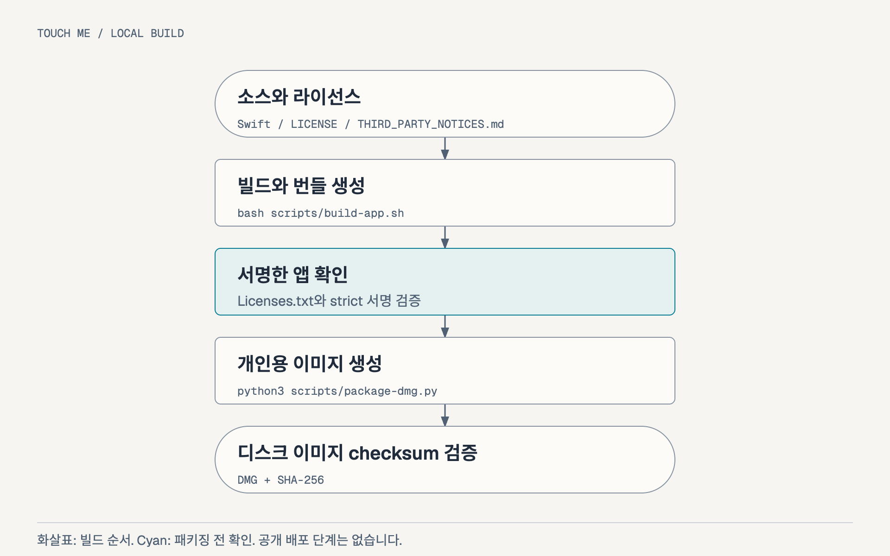

[English](Workflow.md) · [한국어](Workflow.ko.md) · [앱 사용 안내](README.ko.md) · [Homebrew 배포 준비](docs/Homebrew.ko.md)

<!-- meta.contentType: How-to; audience: contributors; goal: build and package Touch Me locally; content plan: environment, modules, build, packaging, checks, recovery, release. -->

# Touch Me 로컬 빌드와 패키징

이 Workflow에 따라 arm64 앱을 빌드하고 번들을 확인한 뒤 개인용 디스크 이미지를 만드세요. 기존 스크립트는 Apple의 로컬 도구와 Python 3를 사용합니다. 제3자 dependency 설치와 산출물 공개는 수행하지 않습니다.

## 개발 환경 준비하기

Apple Silicon Mac, macOS 26 이상, 패키지의 Swift 6.0 manifest와 호환되는 Swift 도구, Python 3가 필요합니다. 프로젝트 폴더에서 명령을 실행하세요. 빌드에는 터치 모니터 연결이 필요하지 않습니다.

앱의 식별자와 버전은 다음 값을 유지합니다:

| 항목                  | 값                                   |
| --------------------- | ------------------------------------ |
| 앱과 실행 파일        | `Touch Me.app` / `TouchMe`           |
| Bundle Identifier     | `io.github.soom-kang.touchme`        |
| Release 버전          | `VERSION`에서 읽는 `0.8.0-beta.1`    |
| 번들 버전             | `0.8.0`과 증가하는 숫자 build 번호   |
| 전체 release metadata | `TouchMeReleaseVersion=0.8.0-beta.1` |
| 대상 환경             | `arm64`, macOS 26 이상               |

문서나 패키징을 바꿀 때는 식별자와 저장한 환경설정 형식을 유지하세요. 서명 identity나 설치 경로를 바꾸면 설치 앱의 권한 확인이 필요할 수 있습니다.

## 모듈별 역할 확인하기

패키지는 실행 상태 로직, macOS 장치 접근과 앱 제어를 나눕니다:

| 모듈               | 역할                                                                            |
| ------------------ | ------------------------------------------------------------------------------- |
| `TouchMappingCore` | 좌표 정규화, 화면 좌표 변환과 접촉 상태별 효과 계산                             |
| `TouchMePlatform`  | USB Human Interface Device(HID) 탐색, 화면 선택, P16KT 모드 복구와 macOS 이벤트 |
| `TouchMeApp`       | 메뉴 막대, 설정·시험 창, 환경설정, 로그인 실행과 재개 판단                      |

앱은 확인한 패널 한 대와 조건에 맞는 외부 화면을 사용합니다. 매핑은 장치를 독점 점유하고, 필요한 경우 확인한 모드를 켭니다. 중지하거나 정상 종료하면 원래 모드로 복구합니다. 복구 오류는 화면에 남고 종료를 차단할 수 있습니다.

현재 소스에는 앱의 네트워크 통신이나 원시 입력 로그 기능이 없습니다. 환경설정에는 선택한 장치·화면 정보, 재개할 의도와 앱 언어 선택을 저장하며, 터치 이력은 저장하지 않습니다. 기본 언어는 영어입니다. 언어를 바꾸면 앱이 만든 UI를 즉시 갱신하며 세션을 재시작하거나 macOS 언어 설정을 바꾸지 않습니다.

## 앱 빌드와 번들 확인하기

Release 실행 파일을 빌드하고 아이콘과 두 라이선스 고지를 번들에 포함하세요:

```bash
bash scripts/build-app.sh
```

스크립트는 `dist/Touch Me.app`을 만들고 이전 로컬 번들의 build 번호를 증가시킵니다. 이전 앱은 `dist/previous-builds`에 보존합니다. Ad hoc 서명 후 `codesign --verify --strict`로 검증합니다.

디스크 이미지를 만들기 전에 번들 metadata와 라이선스 리소스를 확인하세요:

```bash
plutil -p 'dist/Touch Me.app/Contents/Info.plist'
cat 'dist/Touch Me.app/Contents/Resources/Licenses.txt'
codesign --verify --strict 'dist/Touch Me.app'
```

`Licenses.txt`에는 `LICENSE`를 함께 넣습니다. 프로젝트의 라이선스 파일이 없으면 번들 생성을 중단합니다. Ad hoc 서명 검증은 로컬 번들의 무결성을 확인하며, Developer ID 서명이나 notarization의 근거가 되지는 않습니다.

## 개인용 디스크 이미지 만들기

서명한 앱, Applications 바로가기와 두 언어의 설치 안내를 패키징하세요:

```bash
python3 scripts/package-dmg.py
```

스크립트는 앱의 식별자, `VERSION`과 release metadata의 일치, 라이선스 리소스 존재 여부, 서명과 arm64 아키텍처를 확인합니다. 이전 버전 번들이면 새 release 파일명을 붙이지 않고 패키징을 중단합니다. 산출물은 다음과 같습니다:

| 산출물                                        | 용도                    |
| --------------------------------------------- | ----------------------- |
| `dist/Touch Me.app`                           | 로컬 서명한 앱 번들     |
| `dist/touch-me-0.8.0-beta.1-arm64.dmg`        | 로컬 beta 디스크 이미지 |
| `dist/touch-me-0.8.0-beta.1-arm64.dmg.sha256` | SHA-256 checksum        |

기존 이미지는 `dist/previous-builds`로 옮깁니다. `dist`에서 새 checksum을 검증하세요:

```bash
(cd dist && shasum -a 256 -c touch-me-0.8.0-beta.1-arm64.dmg.sha256)
```



[편집 가능한 다이어그램](docs/assets/packaging.ko.html)

마운트한 이미지는 대치하지 마세요. 먼저 정상 추출하세요. 사용 중이면 대치를 중단하고 해당 이미지를 사용하는 앱을 닫으세요. 강제 추출은 사용하지 않습니다.

## 변경에 맞는 최소 검증 선택하기

바뀐 동작에 맞춰 검증하세요. 결함이나 새로운 호환성 주장이 있을 때만 검사를 추가합니다:

| 변경                                | 최소 확인                                                                        |
| ----------------------------------- | -------------------------------------------------------------------------------- |
| 문서 또는 이미지                    | 변경한 문서 전체 읽기; 링크, 번역과 이미지 렌더링 확인                           |
| 라이선스 메뉴 또는 패키징           | Release 빌드 1회; 라이선스 리소스, 서명, 디스크 이미지와 checksum 확인           |
| 앱 언어                             | Release 빌드 1회; 안전한 환경에서 영어 기본값, 양방향 즉시 전환과 선택 유지 확인 |
| 좌표 또는 제스처 로직               | `bash scripts/test.sh` 실행; 대상 패널에서 해당 제스처 확인                      |
| 장치 열기, 모드 복구 또는 lifecycle | 대상 패널의 독점 점유, 입력 해제와 복구 확인                                     |
| 서명, 로그인 실행 또는 호환 범위    | 변경한 환경에서 설치 앱 확인                                                     |

기존 core tests는 순수 로직을 검증합니다. HID 접근, 장치 모드 복구, 권한이나 실기기 동작은 검증하지 않습니다. 문서만 바꾸는 작업에 테스트 인프라를 추가하지 마세요.

언어 확인용 후보 앱을 열기 전에 같은 Bundle Identifier의 다른 앱이 종료됐고 P16KT가 분리됐는지 확인하세요. 확인할 수 없으면 GUI 검증은 `NOT_RUN`으로 기록합니다. 기존 앱이 활성화되거나 저장한 매핑이 재개되는 동작은 후보 검증으로 보지 않습니다. 설정과 메뉴, 이미 열린 시험 창을 확인하고 언어 전환 후 대상 확인과 시험 기록이 유지돼야 합니다. 아래 build 8·9 기록은 과거 검증으로 유지합니다.

보존한 요약은 2026-10-07 build 8의 사용자 보고를 정리합니다. 단독 제스처, 종료·재개, 중지 상태 유지, 로그인 항목 전환과 Finder 설치가 대상입니다. 별도로 패키지, 서명, checksum과 프로세스를 확인한 기록도 있습니다. 이 기록은 재생성한 앱의 새 실기기 검증이 아닙니다. 실제 로그아웃·로그인은 `NOT_RUN`, 자동 재개 후 가로 스크롤은 `NOT_RETESTED`입니다.

2026-10-07의 문서·라이선스 정리에서 build 9를 생성했습니다. Release 컴파일, strict ad hoc 서명 검증, 라이선스 리소스의 정확한 내용, arm64 아키텍처, 두 언어의 설치 안내, 디스크 이미지의 읽기 전용 확인과 SHA-256 검증을 통과했습니다. 패키지의 실행 파일·아이콘은 로컬 앱과 일치했습니다. 매핑 로직을 유지했으므로 core tests와 실기기 확인은 반복하지 않았습니다. 새 앱의 라이선스 메뉴를 여는 동작도 실행하지 않았습니다.

### v0.8.0-beta.1 로컬 준비

2026-10-07(`Asia/Seoul`)의 언어·버전 준비에서 build 10을 생성했습니다. 번들에는 `CFBundleShortVersionString=0.8.0`과 `TouchMeReleaseVersion=0.8.0-beta.1`을 기록했습니다. `bash scripts/build-app.sh`의 warnings-as-errors release 컴파일과 strict ad hoc 서명 검증을 통과했습니다. 번들의 라이선스와 아이콘 내용도 source와 일치했습니다. Command Line Tools의 framework/library search path가 없다는 linker 경고가 있었지만 빌드는 완료됐습니다.

첫 `python3 scripts/package-dmg.py`는 제한된 실행 환경에서 `hdiutil create`에 실패했으며, 로컬 디스크 이미지 접근을 허용한 뒤 성공했습니다. 설치 안내에서 게시 시점에 따라 낡는 문구를 제거한 후 같은 build 10 앱으로 패키징만 반복했습니다. 최종 DMG는 `hdiutil verify`와 위의 SHA-256 검사를 통과했습니다. `ruby -c packaging/homebrew/touch-me.rb.in`이 통과했고 초안의 digest는 최종 후보와 일치합니다. 임시 입력으로 누락·잘못된 `VERSION`과 이전 버전의 번들 metadata가 산출물 대치 전에 거부되는 것을 확인했습니다. 이전 앱·DMG 산출물은 보존했습니다.

GUI 언어 전환, 재실행 후 선택 유지, 열린 시험 창과 문구 잘림은 `NOT_RUN`입니다. USB registry 조회가 실패해 P16KT의 물리적 분리를 확인하지 못했습니다. 기존 Touch Me process는 없었으며 후보 앱을 실행하지 않았습니다. Source 검토로 언어 변경이 모델을 재시작하거나 매핑·로그인 동작을 호출하지 않고 표시만 갱신하는 것을 확인했습니다. Core 로직은 유지해 tests를 반복하지 않았으며 test 파일·dependency는 추가하지 않았습니다. Homebrew style/audit/install, 다운로드한 앱의 Gatekeeper 처리, 실기기 매핑과 로그인 실행도 `NOT_RUN`입니다. 로컬 빌드·서명 결과는 이 동작의 검증을 대신하지 않습니다.

## 실패 시 작업 범위 유지하기

빌드나 패키징이 실패하면 새 산출물 전달을 중단합니다. 보고된 로컬 원인을 수정하고 실패한 명령만 다시 실행하세요. 대체 산출물의 검증을 마칠 때까지 이전에 사용할 수 있던 산출물을 유지합니다.

승인받은 장치 시험 중 모드 복구가 실패하면 P16KT를 같은 USB 포트에 다시 연결하고 중지를 재시도하세요. 실패를 숨기거나, 다른 장치로 바꾸거나, 저장한 재개 의도를 덮어써서 복구했다고 판정하지 마세요.

정리를 마친 폴더에는 `.build`와 `dist/previous-builds`가 없을 수 있습니다. 다음 빌드에서 다시 생성합니다. 삭제 전 정확한 생성 경로와 마운트 상태를 확인하고 외부 폴더를 가리키는 링크는 따라가지 마세요.

## 공개 릴리즈 별도로 준비하기

합의한 `0.8.0-beta.1` 경로는 예정한 개인 Tap `soom-kang/homebrew-touch-me`의 ad hoc beta Cask입니다. 로컬 Workflow에서는 산출물과 Cask 초안을 준비합니다. Remote 생성, push, 공개와 설치는 별도 승인을 받아 진행합니다. 예정한 저장소의 공개 상태는 확인하지 않았습니다.

[Homebrew 배포 준비](docs/Homebrew.ko.md)에서 release 페이즈, checksum 확정, 첫 실행과 Tap 검사를 확인하세요. Ad hoc beta는 공증하지 않으며 Gatekeeper 승인을 주장하지 않습니다. 향후 Developer ID 배포는 서명·공증을 준비하고 최종 설치 산출물의 권한과 장치 동작을 다시 확인해야 합니다.

이 Workflow는 `/Applications` 앱 대치, 개인정보 보호 권한 변경, 로그인 항목 등록, commit, push 또는 공개 배포를 승인하지 않습니다. 각 작업은 받은 승인 범위에 따라 진행하세요. Credential은 명령, 로그와 문서에 기록하지 않습니다.

Touch Me에는 [프로젝트 MIT License](LICENSE)를 적용합니다.
