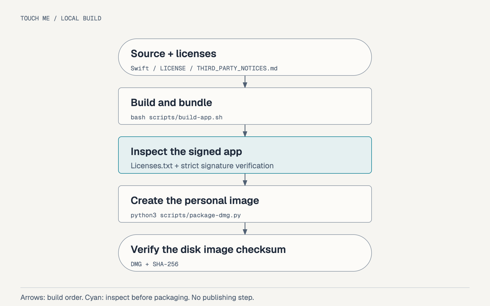

[English](Workflow.md) · [한국어](Workflow.ko.md) · [Use the app](README.md) · [Homebrew distribution](docs/Homebrew.md)

<!-- meta.contentType: How-to; audience: contributors; goal: build and package Touch Me locally; content plan: environment, modules, build, packaging, checks, recovery, release. -->

# Build and package Touch Me locally

Use this workflow to build the arm64 app, inspect its bundle and create a personal disk image. The existing scripts use Apple's local tools and Python 3. They do not install additional dependencies or publish artifacts.

## Prepare your environment

Use an Apple Silicon Mac with macOS 26 or later, Swift tools compatible with the package's Swift 6.0 manifest, and Python 3. Run commands from the project directory. Building does not require a connected touchscreen.

The app keeps these identifiers and versions:

| Field                 | Value                                             |
| --------------------- | ------------------------------------------------- |
| App and executable    | `Touch Me.app` / `TouchMe`                        |
| Bundle identifier     | `io.github.soom-kang.touchme`                     |
| Release version       | `0.8.0-beta.5`, read from `VERSION`               |
| Bundle version        | `0.8.0` plus an incrementing numeric build number |
| Full release metadata | `TouchMeReleaseVersion=0.8.0-beta.5`              |
| Target                | `arm64`, macOS 26 or later                        |

Keep the identifier and saved-preference format stable when changing documentation or packaging. Changing the signing identity or installation path can require permission checks in the installed app.

## Understand the modules

The package separates session logic from macOS device access and app controls:

| Module             | Responsibility                                                                                         |
| ------------------ | ------------------------------------------------------------------------------------------------------ |
| `TouchMappingCore` | Coordinate normalization, screen mapping and contact-state effects                                     |
| `TouchMePlatform`  | USB Human Interface Device (HID) discovery, display selection, P16KT mode restoration and macOS events |
| `TouchMeApp`       | Menu bar, settings and test windows, preferences, login launch and resume decisions                    |

The app accepts one verified panel and an eligible external display. Mapping opens the device exclusively, enables the verified mode when needed, and restores it on Stop or normal Quit. Restoration failure stays visible and can block Quit.

No app networking code or raw-input logging is implemented in the current source. Preferences store the selected device/display identity, the intent to resume and the app's language selection; they do not store a touch history. English is the default, and changing language updates app-owned UI without restarting the session or changing macOS language settings.

## Build and inspect the app

Build the release executable and bundle it with icons and the project license. Initial beta.5 preparation used installed build 21 as the local build-number baseline; one build produced verified build 22. That pre-journal artifact remains historical. The agreed recovery journal now has verified build 23, with strict signature, arm64, metadata, license/icon and 28 frozen inputs passed. Packaging also passed. Build 23 normal-use/relaunch checks are `PASS_USER_REPORTED`; one controlled SIGKILL/relaunch recovered the previous record before mapping resumed and verified `(0,0)` after Stop/Quit. Preserve earlier artifacts; another build increments the counter again:

```bash
bash scripts/build-app.sh
```

The script creates `dist/Touch Me.app`, increments the previous local bundle's build number and preserves the previous app under `dist/previous-builds`. It applies an ad hoc signature and verifies it with `codesign --verify --strict`.

Check the bundle metadata and license resource before making a disk image:

```bash
plutil -p 'dist/Touch Me.app/Contents/Info.plist'
cat 'dist/Touch Me.app/Contents/Resources/Licenses.txt'
cmp Resources/TouchMe.icns 'dist/Touch Me.app/Contents/Resources/TouchMe.icns'
```

`Licenses.txt` contains the project `LICENSE`. A missing license file stops bundling. Ad hoc signature verification confirms local bundle integrity; it does not establish Developer ID signing or notarization.

## Create the personal disk image

Package the signed app, an Applications shortcut and bilingual installation notes:

```bash
python3 scripts/package-dmg.py
```

The script verifies the app's identifier, release metadata against `VERSION`, license-resource presence, signature and arm64 architecture. A stale bundle stops packaging instead of receiving a new release filename. It creates these outputs:

| Output                                        | Purpose                   |
| --------------------------------------------- | ------------------------- |
| `dist/Touch Me.app`                           | Locally signed app bundle |
| `dist/touch-me-0.8.0-beta.5-arm64.dmg`        | Local beta candidate image |
| `dist/touch-me-0.8.0-beta.5-arm64.dmg.sha256` | SHA-256 checksum          |

An existing image moves to `dist/previous-builds` in the release checkout. Verify DMG integrity and its checksum:

The current beta.5 DMG contains build 23; its checksum is recorded in the
[candidate notes](docs/releases/v0.8.0-beta.5.md). Build 22's checksum is historical
and cannot validate build 23.

```bash
hdiutil verify dist/touch-me-0.8.0-beta.5-arm64.dmg
(cd dist && shasum -a 256 -c touch-me-0.8.0-beta.5-arm64.dmg.sha256)
```



[Editable diagram](docs/assets/packaging.html)

Do not replace an image while it is mounted. Eject it normally first. If it is busy, stop the replacement and close the application using it; do not force eject.

## Choose the minimum checks

Match verification to the behavior you changed. Add checks only when a defect or a new compatibility claim requires them:

| Change                                        | Minimum check                                                                                               |
| --------------------------------------------- | ----------------------------------------------------------------------------------------------------------- |
| Documentation or image                        | Read the whole affected document; check links, translations and rendered images                             |
| License menu or packaging                     | One release build; inspect license resources, signature, disk image and checksum                            |
| App language                                  | One release build; check English default, both directions of immediate switching and persistence where safe |
| Coordinate or gesture logic                   | Run `bash scripts/test.sh`; check the affected gesture on the target panel                                  |
| Device opening, mode restoration or lifecycle | Check exclusive ownership, input release and restoration on the target panel                                |
| Signing, login launch or compatibility        | Check the installed app in the changed environment                                                          |

Initial beta.5 build 22 reused the existing Swift targets, one build and one packaging run. Normal smoke is `PASS_USER_REPORTED`; captured original mode recovery after its one approved SIGKILL/relaunch/Stop/Quit was `FAIL`. Diagnostic recovery verified `(0,0)`. The agreed journal is now implemented in source; all targets compiled and focused DeviceMode checks (3), journal checks (6), candidate build 23 and packaging passed. Build 23 normal-use checks, Stop/Quit/relaunch staying stopped and active-Quit/relaunch resuming are `PASS_USER_REPORTED`. A separate normal-Quit-route readback at 16:20:05 KST verified `(0,0)`; immediately preceding mapping was not directly observed. One additional approved SIGKILL retained `(2,0)` and the exact record; the relaunched candidate verified prior recovery/record clearing before resume, followed by Stop/Quit and direct `(0,0)` readback. TMQA003 is PASS for this original-0/same-boot/continuous-attachment case. Post-crash resume, two taps, no error and Stop/Quit are `PASS_USER_REPORTED`. Fresh installation, permission off/on, lock/sleep, full logout/login and removal remain excluded. See the [beta.5 acceptance record](docs/qa/beta5-native-acceptance.md); publication awaits review; public Homebrew upgrade acceptance follows verified publication.

On 2026-10-09, beta.5 reused the planning-phase `bash scripts/test.sh` PASS for 24 existing tests (11 Platform, 13 Core) without repeating it. One `bash scripts/build-app.sh` and one `python3 scripts/package-dmg.py` produced build 22 and a 419,445-byte DMG. Compilation, strict ad hoc signature, bundle metadata, license/icon, arm64, the 27-input manifest comparison, `hdiutil verify` and the SHA-256 sidecar check passed. These local results do not establish native mapping or publication; the checksum and remaining checks are in the [candidate notes](docs/releases/v0.8.0-beta.5.md).

The existing core tests cover pure logic. They do not prove HID access, device-mode restoration, permissions or behavior on a physical panel. The gesture fix already passed all 14 existing Swift tests, and build 20 gesture behavior is `PASS_USER_REPORTED`; neither result is a direct device check of build 21. The approved beta.4 release reuses these results while gesture code stays unchanged. It adds no tests or validation infrastructure and does not repeat the full suites. Its release checks are one build and packaging run, strict signature, metadata, license/icon, arm64, DMG integrity/checksum, Cask style, public downloads and online audit. Build 21 device, Gatekeeper and Homebrew installation checks are `NOT_RUN`. Repeat a successful build only after a relevant source change: another build can change its number, signature and DMG bytes. Record beta.4 artifact and publication results in the [release notes](docs/releases/v0.8.0-beta.4.md).

Before opening a language-check candidate, confirm that any other app with the same Bundle Identifier has quit and the P16KT is disconnected. Otherwise record GUI checks as `NOT_RUN`. An existing app being activated, or a saved mapping session resuming, is not evidence for the candidate. Check the menu and an already-open test window as well as settings; switching languages must preserve target confirmation and test history. Recorded build 8 and build 9 checks below remain historical evidence.

The retained 2026-10-07 build 8 notes record user-reported standalone gestures, Quit/resume, Stop persistence, login-item toggling and Finder installation. They also record package, signature, checksum and process checks. Those records do not prove behavior in a newly rebuilt app. Full logout/login is `NOT_RUN`; horizontal scrolling after automatic resume is `NOT_RETESTED`.

The 2026-10-07 documentation and license update produced build 9. Release compilation, strict ad hoc signature verification, exact license-resource content, arm64 architecture, bilingual installation notes, read-only disk-image inspection and SHA-256 verification passed. The packaged executable and icon matched the local app. Core tests and device checks were not repeated because mapping logic stayed unchanged; opening the new app's License menu was not exercised.

### v0.8.0-beta.1 local preparation

On 2026-10-07 (`Asia/Seoul`), the language/version preparation produced build 10 with `CFBundleShortVersionString=0.8.0` and `TouchMeReleaseVersion=0.8.0-beta.1`. `bash scripts/build-app.sh` passed release compilation with warnings as errors and strict ad hoc signature verification. Exact bundled license content and icon content matched the source. Missing Command Line Tools framework/library search paths produced non-fatal linker warnings; the build completed.

The first `python3 scripts/package-dmg.py` attempt failed at `hdiutil create` under the restricted execution environment. It succeeded with the required local disk-image access. After removing publication-timing wording from the installation notes, only packaging was repeated with the same build 10 app. That DMG passed `hdiutil verify` and its SHA-256 check. `ruby -c packaging/homebrew/touch-me.rb.in` passed, and the draft's digest matched that candidate. Missing/invalid `VERSION` and stale bundle metadata were checked in temporary inputs and rejected before artifact replacement. These checks cover the build 10 preparation; a later release candidate needs its own artifact checksum and packaging results. Previous app and DMG artifacts were retained.

GUI language switching, relaunch persistence, open test-window behavior and clipping are `NOT_RUN`: USB registry queries failed, so physical P16KT disconnection could not be confirmed. No existing Touch Me process was found, and the candidate was not launched. Source review confirmed that language changes update presentation without restarting models or calling mapping/login actions. Core tests were not repeated because core logic is unchanged; no test files or dependencies were added. Homebrew style/audit/install, downloaded Gatekeeper handling, device mapping and login launch remain `NOT_RUN`. Local build/signature results do not establish those behaviors.

### v0.8.0-beta.1 release candidate

On 2026-10-07 (`Asia/Seoul`), release preparation produced build 11. One release build passed compilation with warnings as errors and strict ad hoc signature verification. The bundled `Licenses.txt` exactly matched the project `LICENSE`. Packaging rejected the previous bundle's different license resource before staging; the rebuilt app passed packaging, arm64 checks, `hdiutil verify` and SHA-256 verification.

The frozen DMG SHA-256 is `eb255a5296921c93c2cd8d9de98b7424fc380e7b3a24e713c682df0cf500b618`. The local Cask draft and Tap Cask use that digest. Ruby syntax passed. The first Homebrew style run needed access to its tool cache; the style check then reported a redundant platform name in the Cask description. After correcting that description, the same file passed with no offenses. English/Korean packaging images were regenerated with the existing design and checked for clipping. See the [release notes](docs/releases/v0.8.0-beta.1.md) for support and validation limits.

This candidate's GUI, Gatekeeper, real-device, login-launch and Homebrew installation checks remain `NOT_RUN`. Source and Tap publication and online audit follow the runbook phases; their actual results are recorded separately from local artifact checks.

### v0.8.0-beta.2 release candidate

On 2026-10-07 (`Asia/Seoul`), the existing Python packaging suite initially passed 17 of 18 tests. The permission-failure fixture used the macOS `/var` path alias while packaging resolved it to `/private/var`, so its mock did not exercise the intended failure. Resolving the fixture's temporary root fixed that mismatch; the repeated suite passed all 18 tests. The existing Swift suite passed all 14 tests in one run. No new tests or validation infrastructure were added.

One release build produced build 12 with numeric bundle version `0.8.0` and `TouchMeReleaseVersion=0.8.0-beta.2`. Release compilation, strict ad hoc signature verification, exact bundled license/icon content, arm64 packaging, `hdiutil verify` and SHA-256 verification passed. Missing Command Line Tools framework/library search paths produced non-fatal linker warnings. The frozen DMG SHA-256 is `b667c7ba2518b966fec2fdc4b92152d66db58b0758460e5c5f4daa42cd5d3469`. These are local artifact results; publication, Cask style and online audit results are recorded separately. GUI, Gatekeeper, real-device, login-launch and Homebrew installation checks are `NOT_RUN`. See the [release notes](docs/releases/v0.8.0-beta.2.md) for this release's changes and limits.

### v0.8.0-beta.3 release preparation

On 2026-10-08 (`Asia/Seoul`), one release build and packaging run in a separate checkout produced build 19 with `TouchMeReleaseVersion=0.8.0-beta.3`, preserving the active development build 18 and the Applications app. The 23 compilation and bundle inputs matched the working checkout. Release compilation, strict ad hoc signature verification, bundle metadata, exact license/icon content, arm64 architecture, `hdiutil verify` and SHA-256 verification passed. The frozen DMG SHA-256 is `7f3b500c8efa0d7195e54f581fd0cc4d0fb6265ff54464b39ce6eeb9e7dfef76`. Homebrew style inspected the actual Tap `Casks/touch-me.rb` and passed with one file and no offenses. No new tests or full-suite reruns were added for release preparation.

These are local artifact and style results. Public download and online audit results are recorded separately on the [published beta.3 release](https://github.com/soom-kang/touch-me/releases/tag/v0.8.0-beta.3). Earlier test and artifact records above remain historical; they do not establish beta.3 artifact or installation checks. The release app was not installed or launched for new GUI, Gatekeeper, real-device or login-launch checks.

## Handle failures without changing the scope

A build or packaging failure is a stop condition for delivering a new artifact. Fix the reported local cause and repeat only the failed command. Retain the previous usable artifact until the replacement passes its checks.

If device restoration fails during an approved device check, keep the current connection and choose Retry restore. A changed attachment blocks recovery; preserve its record and error. Do not hide the failure, silently switch devices or overwrite the stored resume intent to claim recovery.

After a completed cleanup, `.build` and `dist/previous-builds` may be absent. Subsequent builds recreate them. Inspect the exact generated paths and active mounts before removing them; do not follow symlinks into external folders.

## Publish the reviewed release

Postpublication record, 2026-10-09: source/tag `4ead3d1acec3beb43a1f09261b308ef9fdef0e81` and the [beta.5 prerelease](https://github.com/soom-kang/touch-me/releases/tag/v0.8.0-beta.5) are public. Anonymous DMG/sidecar download matched the frozen build 23; prior beta.4 assets were preserved. Tap and installed Tap are `31cdb32c1e1415401c26fd338842bf811471b531`. The public Homebrew upgrade phase and installed artifact checks passed. Its later automatic core clone was interrupted and cleaned up; the complete command exited 130. Post-upgrade GUI/native checks remain pending and QA01 is `PENDING`. See the [acceptance record](docs/qa/beta5-native-acceptance.md).

### Historical prepublication checkpoint — 16:24 KST

The 2026-10-09 prepublication record is `READY_FOR_RELEASE_REVIEW / NOT_PUBLISHED`. Build 23 passed bounded TMQA003 acceptance; QA01 public upgrade remains `NOT_RUN`. At that checkpoint release commit/push, tag, publication and Tap update were not performed. After approval, compare frozen source/package inputs with the release commit, publish the reviewed asset and verify its public bytes before updating the Tap. Keep prior assets and preferences. Run public-upgrade acceptance afterward. See the [release notes](docs/releases/v0.8.0-beta.5.md) and [Homebrew preparation](docs/Homebrew.md#beta5-preparation).

### Historical beta.4 release scope

The approved `0.8.0-beta.4` prerelease updates the ad hoc beta Cask in the existing personal Tap `soom-kang/homebrew-touch-me`. The source repository is [soom-kang/touch-me](https://github.com/soom-kang/touch-me). The 2026-10-09 baseline is source `main` at `91142b7bb1137452ae6618b09cea5488e1c8849e`, with six uncommitted gesture-related files, public beta.1–beta.3 releases and Tap remote `main` at `55d661ae2d5a4409db7d720d4988556592769970`. Preserve existing tags and assets. The release authorization covers the reviewed source and release-documentation updates, source/Tap commits and pushes, the new tag/prerelease and the existing Tap update through online audit. Before tagging, compare compilation and packaging inputs in the frozen release checkout with the final source commit. Each phase advances when its checks pass; a new consequential decision or failed check stops the affected phase.

Follow [Homebrew distribution](docs/Homebrew.md) for release phases, checksum freeze, first-launch handling and Tap checks. The ad hoc beta is not notarized and does not claim Gatekeeper approval. A future Developer ID release requires signing, notarization and a new check of the final installed artifact's permissions and device behavior.

After publishing the Tap, fast-forward the clean installed Tap to the reviewed public revision and audit its named Cask using the existing selected-Cask trust. Do not expand trust or install/upgrade the app. Homebrew installation, replacement of `/Applications/Touch Me.app`, GUI/device checks, privacy changes and login-item registration are outside this release run. Future executions require their own authorized scope. Keep credentials out of commands, logs and documentation.

Touch Me uses the [project MIT License](LICENSE).
